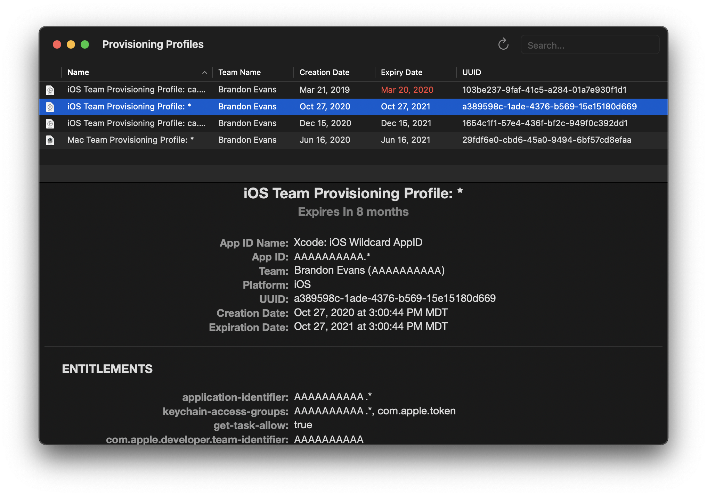

# Provisioning Profiles Browser

- View all of the provisioning profiles in `~/Library/MobileDevice/Provisioning Profiles`
- See their actual names, dates, etc. instead of just their UUID filenames
- Get a Quick Look view of all of the info
- Sort by any column
- Filter by name, team name or UUID
- Double click icon to reveal in finder, or drag it like a file
- List automatically updates when the directory contents change

You can download a .zip of the latest version of the app [here](https://github.com/interstateone/ProvisioningProfilesBrowser/releases/latest). It's a Developer ID-signed and notarized release build.

Dependencies:

- [Sherlouk/SwiftProvisioningProfile](https://github.com/Sherlouk/SwiftProvisioningProfile)
- [njdehoog/Witness](https://github.com/njdehoog/Witness)
